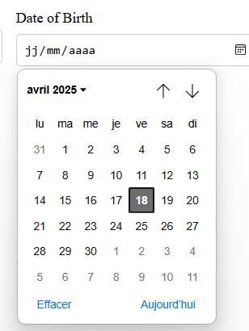

---

# 📅 react-datefield

[](https://github.com/samaki08/react-datefield)

React simple, personnalisable et typé pour la saisie de dates dans vos formulaires.
---

## 📸 Aperçu

[](https://github.com/samaki8/react-datefield/blob/main/image.png)

- **Samira** – Développeur principal, conception API et tests
- **Contributeurs** : [Voir la liste des contributeurs](https://github.com/samaki08/react-datefield/graphs/contributors)


---

## 🚀 Description

**react-datefield** est un composant React réutilisable pour la saisie de dates, pensé pour s'intégrer facilement dans tous vos formulaires. Il gère la validation, l'affichage des erreurs et la personnalisation via des props.  
Idéal pour les projets nécessitant une expérience utilisateur fluide et accessible sur la gestion des dates.

---

## 🛠️ Technologies utilisées


- **prop-types** 15.8.1
- **Jest** 29.7.0
- **@testing-library/react** 16.3.0
- **Babel** 7.21.x

---

## 📦 Installation

```bash
npm install @sc-component/react-datefield
# ou
yarn add @sc-component/react-datefield
```

---

## 📝 Utilisation

```jsx
import DateField from '@sc-component/react-datefield';

function MonFormulaire() {
  const register = () => ({}); // Remplacez par votre logique de formulaire
  const errors = {};

  return (
    <form>
      <DateField name="date" register={register} errors={errors} />
    </form>
  );
}

```
Important : Pour que les styles soient appliqués, importez explicitement le CSS dans votre projet principal si besoin :

js
import '@sc-component/react-datefield/dist/components/styles/datefield.css';
(Nécessaire si votre bundler ne gère pas automatiquement les imports CSS dans node_modules.)

---

## ⚙️ Scripts disponibles

- `npm run build` : Transpile le code source avec Babel.
- `npm run test` : Lance la suite de tests unitaires avec Jest.
- `npm run prepublishOnly` : Build automatique avant publication npm.

---

## 🧪 Tests

### Lancer les tests unitaires

```bash
npm run test
```

Les tests sont écrits avec **Jest** et **@testing-library/react**.  
Vous pouvez les retrouver dans `src/components/DateField.test.jsx`.

---

## 🤝 Contribuer

Les contributions sont **bienvenues** !  
Pour contribuer :

1. Forkez ce dépôt
2. Créez une branche (`git checkout -b feature/ma-nouvelle-feature`)
3. Commitez vos modifications (`git commit -m 'Ajout nouvelle feature'`)
4. Poussez la branche (`git push origin feature/ma-nouvelle-feature`)
5. Ouvrez une **Pull Request**

---

## 📄 Licence

Ce projet est sous licence **MIT**.  
Voir le fichier [LICENSE](LICENSE) pour plus d’informations.

---

> _N’hésitez pas à ouvrir une issue ou une PR pour toute suggestion ou amélioration !_

---
